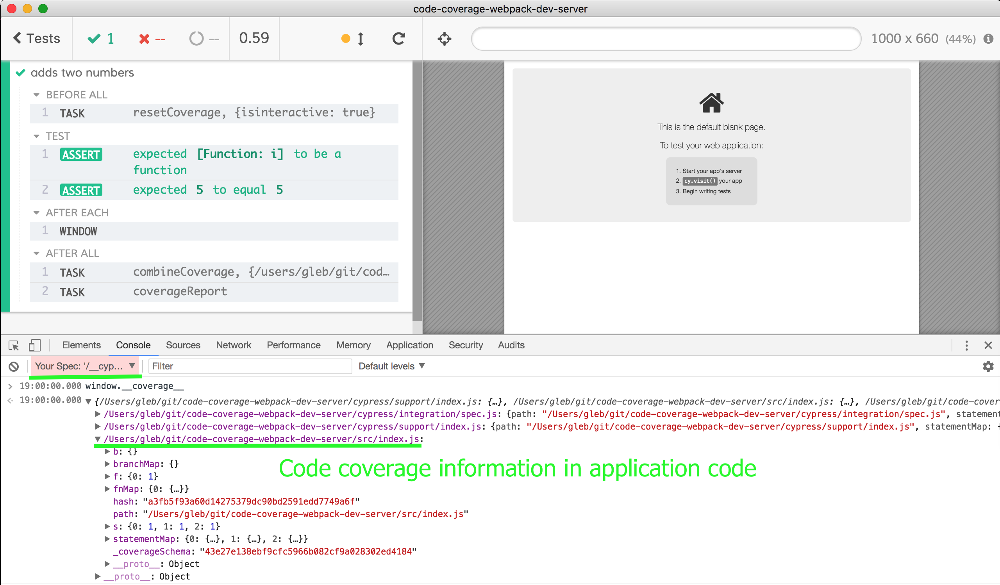

# code-coverage-webpack-dev-server [![renovate-app badge][renovate-badge]][renovate-app] [](https://circleci.com/gh/bahmutov/code-coverage-webpack-dev-server)
> Example of Cypress.io code coverage collected from webpack dev server

Webpack dev server setup following blog post [Webpack with Babel 7 Project Setup](https://dev.to/shoupn/webpack-with-babel-7-project-setup-2hin).

## Install and start

```shell
npm ci
npm start
```

Open `localhost:8080`

## Code instrumentation

Find examples of end-to-end and unit tests in [cypress/integration/spec.js](cypress/integration/spec.js) file.

### End-to-end tests

Application's source code is instrumented via Webpack + Babelrc. The instrumentation is only enabled in `NODE_ENV=test` environment via the [`env` option](https://new.babeljs.io/docs/en/next/babelrc.html#env-environment-option) in [.babelrc](.babelrc) file. This file is used to transpile source code because of [webpack.config.babel.js](webpack.config.babel.js)

To serve the app using [webpack-dev-server](https://github.com/webpack/webpack-dev-server) with instrumented app and open Cypress use:

```shell
npm run dev
```

Notice the `window.__coverage__` object in the application iframe:


To run headless end-to-end tests and have coverage use:

```shell
npm run e2e
```

### Unit tests

If you decide to load application's JavaScript directly from the spec files (without `cy.visit`) you are effectively doing unit tests in Cypress. To instrument those files, you need to insert Istanbul plugin into the bundler Cypress uses to bundle the spec files. Since this project already uses Webpack, install [@cypress/webpack-preprocessor](https://github.com/cypress-io/cypress-webpack-preprocessor)

```shell
npm i -D @cypress/webpack-preprocessor
```

Then set that preprocessor to transpile spec files and use same settings as your regular Webpack in [cypress/plugins/index.js](cypress/plugins/index.js) file.

You should see instrumented source files in the `Spec` iframe when Cypress runs.



Cypress code coverage plugin automatically combines end-to-end and unit test code coverage information and produces a combined report.

### Reports

The coverage HTML and other reports are saved into folder `coverage`. You can open HTML report with

```shell
open coverage/index.html
```


## NPM scripts

See [package.json](package.json) for all NPM scripts.

## More information

- Read Cypress [code coverage guide](https://on.cypress.io/code-coverage)

[renovate-badge]: https://img.shields.io/badge/renovate-app-blue.svg
[renovate-app]: https://renovateapp.com/
