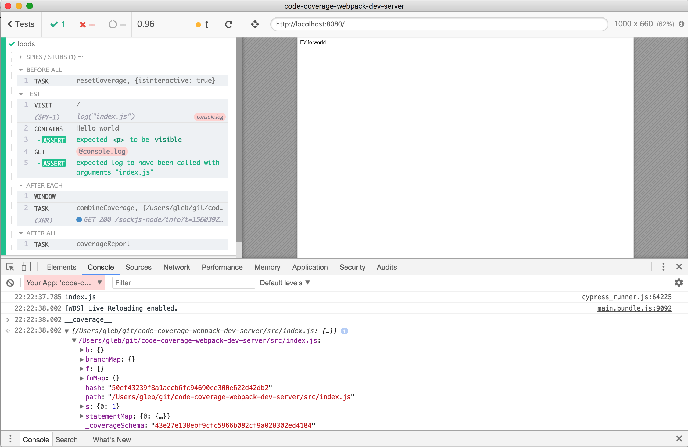
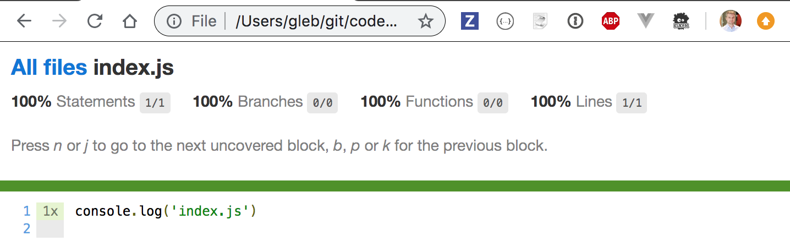

# code-coverage-webpack-dev-server
> Example of Cypress.io code coverage collected from webpack dev server

Webpack dev server setup following blog post [Webpack with Babel 7 Project Setup](https://dev.to/shoupn/webpack-with-babel-7-project-setup-2hin).

## Install and start

```shell
npm ci
npm start
```

Open `localhost:8080`

## Code instrumentation

Only enabled in `NODE_ENV=test` environment via [`env` option](https://new.babeljs.io/docs/en/next/babelrc.html#env-environment-option) in [.babelrc](.babelrc) file.

To server the app using [webpack-dev-server](https://github.com/webpack/webpack-dev-server) with instrumented app and open Cypress use:

```shell
npm run dev
```

Notice the `window.__coverage__` object in the application iframe:



To run headless end-to-end tests and have coverage use:

```shell
npm run e2e
```

In both cases, the coverage HTML report will be saved, open it with

```shell
open coverage/index.html
```



## More information

- Read Cypress [code coverage guide](https://on.cypress.io/code-coverage)
